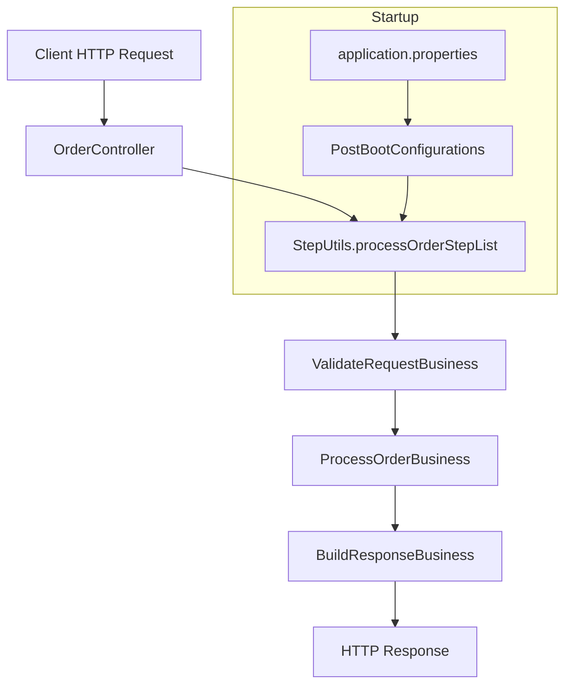

# stepListDemo

A Spring Boot (Kotlin) demo that shows the **stepList pattern**: controllers orchestrate a pipeline of business steps whose order and implementations are defined in `application.properties`.

This keeps controllers thin and lets you change business flow without modifying controller code.

## What is the stepList pattern?

Instead of calling business services directly in a controller, you:

1. Define a JSON step list in `application.properties`
2. Load those steps at startup via reflection
3. Store them in an ordered map (`StepUtils`)
4. Execute each step in sequence from the controller

If any step returns a failure response code, the remaining steps are skipped.



## Tech stack

- Java 17
- Kotlin 2.3
- Spring Boot 4.1
- Maven

## Project structure

```
src/main/kotlin/com/example/steplistdemo/
├── StepListDemoApplication.kt      # Main Spring Boot entry point
├── ServletInitializer.kt             # WAR deployment support
├── business/
│   ├── ExecuteBusiness.kt            # Interface for all steps
│   ├── ValidateRequestBusiness.kt    # Step 1: validation
│   ├── ProcessOrderBusiness.kt       # Step 2: processing
│   └── BuildResponseBusiness.kt      # Step 3: response building
├── configuration/
│   └── PostBootConfigurations.kt   # Loads steps from properties at startup
├── controller/
│   └── OrderController.kt            # Executes the step list
├── dto/
│   └── OrderRequest.kt               # API request model
├── model/
│   ├── BaseResponse.kt               # API response wrapper
│   └── ResponseCode.kt               # Shared response constants
└── utilities/
    └── StepUtils.kt                  # In-memory step registry
```

## Configuration

Step lists are defined in `src/main/resources/application.properties`:

```properties
processOrderSteps=[
  {"name":"validateRequest","class":"com.example.steplistdemo.business.ValidateRequestBusiness"},
  {"name":"processOrder","class":"com.example.steplistdemo.business.ProcessOrderBusiness"},
  {"name":"buildResponse","class":"com.example.steplistdemo.business.BuildResponseBusiness"}
]
```

| Field   | Description |
|---------|-------------|
| `name`  | Unique step key used in logs, response map, and cross-step lookups |
| `class` | Fully qualified class name implementing `ExecuteBusiness` |

Steps run in the **exact order** they appear in the JSON array.

## Run the application

```bash
./mvnw spring-boot:run
```

Or build and run tests:

```bash
./mvnw test
```

The app starts on `http://localhost:8080`.

## API example

### Process order

**Endpoint:** `POST /api/orders/process`

**Request:**

```bash
curl -X POST http://localhost:8080/api/orders/process \
  -H "Content-Type: application/json" \
  -d '{
    "orderId": "ORD-001",
    "amount": 99.99,
    "customerName": "John Doe"
  }'
```

**Success response (example):**

```json
{
  "responseCode": "200",
  "responseMessage": "Order completed successfully",
  "data": {
    "orderId": "ORD-001",
    "customerName": "John Doe",
    "amount": 99.99,
    "processingResult": {
      "orderId": "ORD-001",
      "status": "PROCESSED",
      "amount": 99.99,
      "customerName": "John Doe"
    }
  }
}
```

**Validation failure (example):**

```json
{
  "responseCode": "400",
  "responseMessage": "Order ID is required",
  "data": null
}
```

## How execution works

1. `OrderController` receives the request.
2. It loops through `StepUtils.processOrderStepList` in configured order.
3. Each step implements:

```kotlin
fun execute(request: Any?, response: HashMap<String, BaseResponse>?): BaseResponse
```

4. Each step response is stored in `stepResponses` by step name.
5. Later steps can read earlier step outputs from the `response` map.
6. If `responseCode != "200"`, the controller returns immediately.

## Key Spring annotations used

| Annotation | Purpose |
|------------|---------|
| `@SpringBootApplication` | Enables auto-configuration, component scanning, and app bootstrap |
| `@Component` | Registers `PostBootConfigurations` as a Spring bean |
| `@EventListener(ApplicationReadyEvent::class)` | Runs step registration after the app is fully started |
| `@RestController` | Marks REST controller; serializes return values to JSON |
| `@RequestMapping` | Sets base URL path for controller endpoints |
| `@PostMapping` | Maps HTTP POST to a handler method |
| `@RequestBody` | Deserializes JSON request body into a Kotlin/Java object |
| `@SpringBootTest` | Loads full Spring context in tests |

## Add a new business step

1. Create a class implementing `ExecuteBusiness`:

```kotlin
class MyNewStepBusiness : ExecuteBusiness {
    override fun execute(request: Any?, response: HashMap<String, BaseResponse>?): BaseResponse {
        // business logic
        return BaseResponse(responseCode = "200", responseMessage = "Success")
    }
}
```

2. Add it to `processOrderSteps` in `application.properties` at the desired position.
3. Restart the application.

No controller changes are required.

## Add a new API flow (new step list)

1. Create business step classes.
2. Add a new map in `StepUtils`:

```kotlin
val cancelOrderStepList: MutableMap<String, ExecuteBusiness> = linkedMapOf()
```

3. Add a new property in `application.properties`:

```properties
cancelOrderSteps=[{"name":"validateCancel","class":"com.example.steplistdemo.business.ValidateCancelBusiness"}]
```

4. Register it in `PostBootConfigurations.prepareStepsList()`:

```kotlin
registerSteps("cancelOrderSteps", StepUtils.cancelOrderStepList)
```

5. Create a controller that iterates `StepUtils.cancelOrderStepList`.

## Design notes

- **Config-driven flow:** Change step order or implementation by editing properties.
- **Fail-fast:** Validation and business errors stop the pipeline early.
- **Shared context:** Steps can pass data through the `response` map.
- **Reflection-based registration:** Step classes are instantiated with `Class.forName(...).newInstance()`, not Spring DI. Keep step classes simple or refactor to Spring beans if you need injection.

## Troubleshooting

| Issue | Check |
|-------|-------|
| Step not executed | Property key matches `registerSteps(...)` call in `PostBootConfigurations` |
| `ClassNotFoundException` | Fully qualified class name in properties is correct |
| Steps run in wrong order | Order in JSON array in `application.properties` |
| Empty step list at runtime | App logs for "Property ... is missing or empty" |

## License

Internal demo project.
